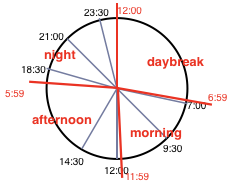

# Predict UserBehaviour
Predict person behaviour used their data which gathered by smartphone

## What this project?
Recent day many people have their own smartphone.
Smart phone always stay near by their owner.
So I think smartphone can predict their owner's behaviour
This project is method how smartphone predict their owner's behaviour

## Outline
### Data Attribution
```
* Time
* Acceleration
* Location
* Day
```

### User Behaviour Label
```
* Sleep
* Exercise
* Work
* Play
```

## Data
### Data PreProcessing
Change all of data to nominal scale

#### Location
Use SmartPhone GPS Data
smartphone gps data is ordinal scale data so we should change to nominal scale data use Google Reverse GeoCoding API

#### Time
Time data also ordinal scale data so change to nominal scale data
I classify 4 label
```
* morning
* afternoon
* night
* daybreak
```


#### Acceleration
Acceleration data also ordinal scale data so change to nominal scale data too
I classify 2 label
```
* active(0 < accel_data < 3)
* nonactive(accel_data > 3)
```

## MachineLearning Algorithm
Naive Bayesian Algorithm
